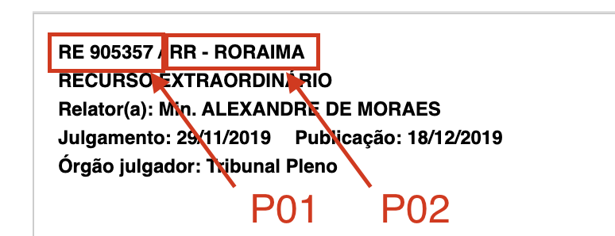

# Database model

## The unique identifyer


The unique ideintifyer used on the jurisprudency scrapper is composed by 2 parts, that are:

P01
P02




The 2 parts are combined in order to form a unique id, that takes the form of `RE905357/RR-RORAIMA`. It is PE1 and PE02 combined without spaces. 


## The database model


The database model consist of just one table, that containss the following fields:

- id, that is the unique identifier of the jurisprudency.
- type, tha descrybe the type of the decision. 
- judgment_date, that is the date of the decision.
- reporter_judge, that is the judge that wrote the decision.
- publication_date, that is the date of the publication of the decision.
- court, that is the court that the decision was made.
- publication, that contains the publication details of the decision. 
- parties, that contains the parties of the decision. (long text)
- menu, (ementa in portuguese) that contains the menu of the decision.(long text)
- decision, that contains the decision itself.(long text)
- theme, that contains the theme of the decision.(long text)
- thesys (tese in portuguese), that contains the thesys of the decision.(long text)
- indexing, that contains the indexing of the decision.(long text)
- legislation, that contains the legislation of the decision.(long text)
- observation, that contains the observation of the decision.(long text)
- doctrine, that contains the doctrine of the decision.(long text)
- full_body url, that contains the url of the full body of the decision. (Long URL)


the sql query to create this table is: 
    
    ```sql
    CREATE TABLE jurisprudencia (
        id VARCHAR(255) PRIMARY KEY,
        type VARCHAR(255),
        judgment_date VARCHAR(255),
        reporter_judge VARCHAR(255),
        publication_date VARCHAR(255),
        court VARCHAR(255),
        publication TEXT,
        parties TEXT,
        menu TEXT,
        decision TEXT,
        theme TEXT,
        thesys TEXT,
        indexing TEXT,
        legislation TEXT,
        observation TEXT,
        doctrine TEXT,
        full_body_url TEXT
    );
    ```